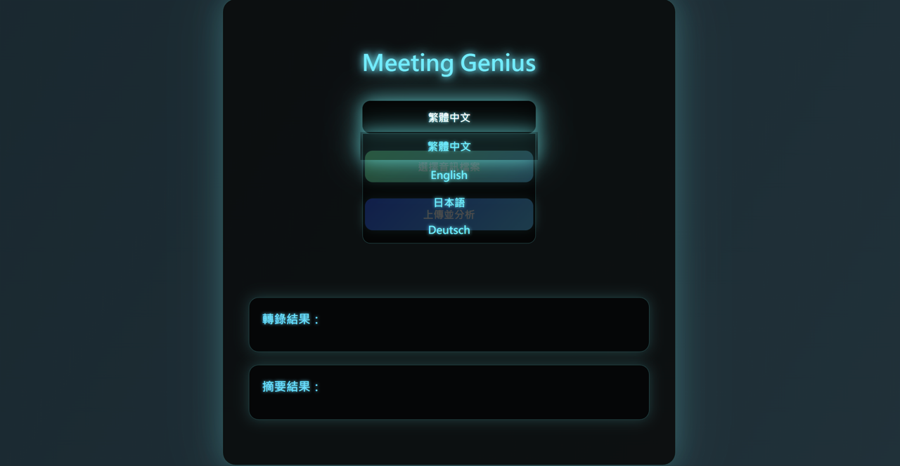
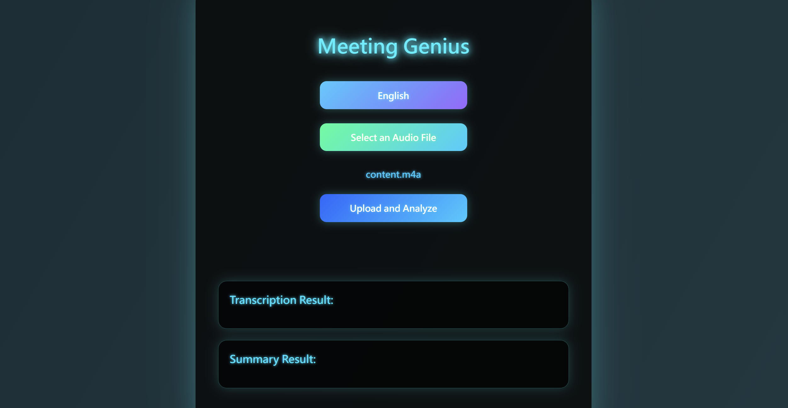
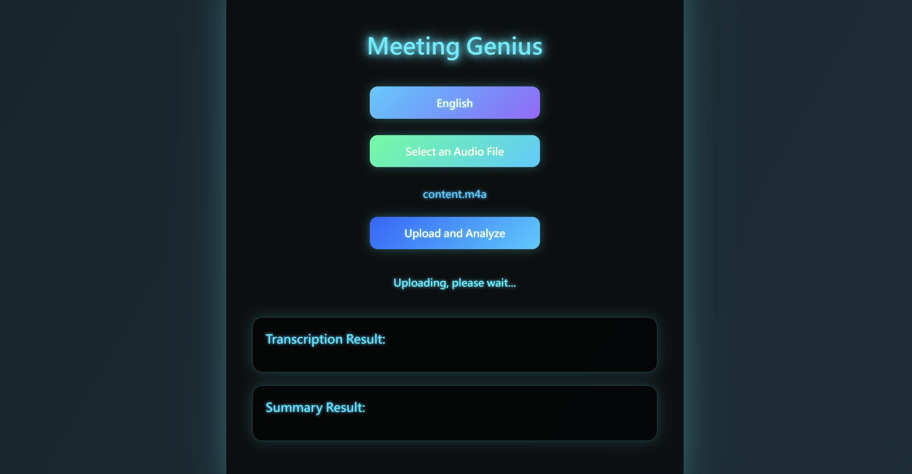
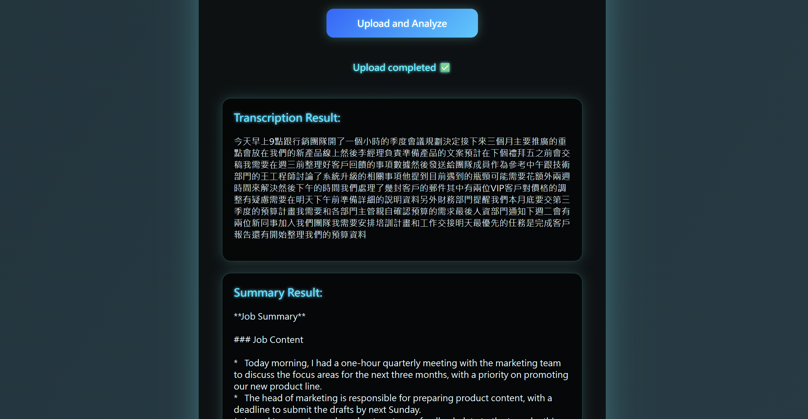

# MeetingGenius

## 🧠 Introduction
This project is an intuitive web application that allows users to upload meeting audio. It leverages **LLM model** to perform **real-time speech-to-text transcription** and **content summarization**, presenting high-quality textual results on the front end and effectively enhancing meeting information management efficiency.

## 🚀 Key Features
- Utilizes the **Whisper-Medium** model for high-accuracy speech-to-text transcription
- Leverages the **Llama-3.2-3B-Instruct** model for automated summary generation
- Backend built with **FastAPI** to create a high-performance API and integrate frontend and backend
- Frontend developed with **HTML/CSS/JavaScript**, featuring a clean and intuitive interface
- Implements **real-time audio upload and analysis**, with automatic storage and backup of relevant files

## ⭐ Usage Workflow
This section demonstrates the step-by-step process for converting audio files into meeting notes using the web interface.

### Step 1. 🖥 Open the web interface
Prepare the audio file you want to convert into meeting notes and open the web interface.

### Step 2. 🌐 Select language
Select your preferred language. Currently, Traditional Chinese, English, Japanese, and German are supported. The meeting summary will be generated in your chosen language.

### Step 3. 📁 Select an audio file
Click the "Select Audio File" button and choose a file from your device. The file name will be displayed immediately, confirming your selection.

### Step 4. ⏱ Upload and analyze
Click the "Upload and Analyze" button. The status will display a "Uploading, please wait..." message, and the system will immediately perform transcription and generate the summary.

### Step 5. 📄 View results
The transcribed text and automatically generated summary are displayed, enabling quick understanding of the meeting content.

## 📚 Reference
- Llama-3.2-3B-Instruct: [Hugging Face](https://huggingface.co/meta-llama/Llama-3.2-3B-Instruct)
- whisper-medium: [Hugging Face](https://huggingface.co/openai/whisper-medium)
