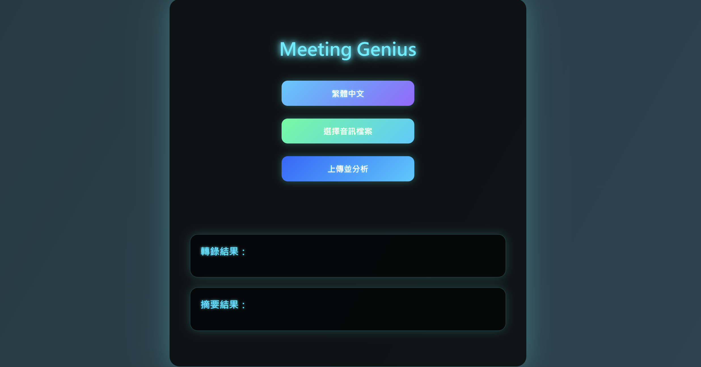
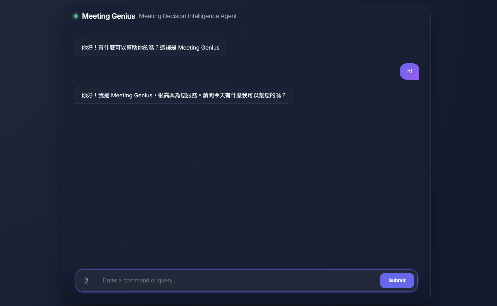
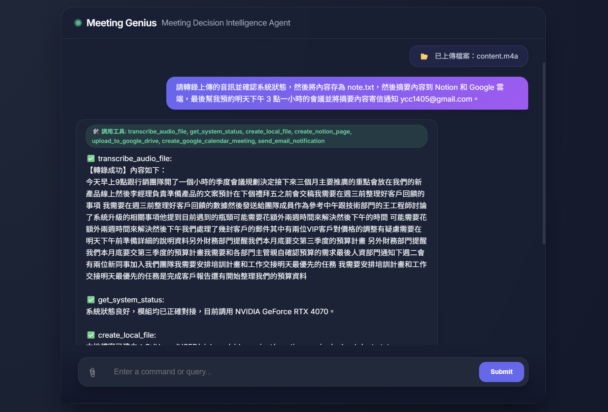

# MeetingGenius

## 🧠 Introduction
Meeting Genius is an advanced meeting assistant that integrates **Agentic AI** with the **Model Context Protocol (MCP)**. Beyond standard conversational capabilities, it transforms local Large Language Models (LLMs) into autonomous agents equipped with "reasoning" and "actionable" powers. The system facilitates an end-to-end decision-making workflow, seamlessly bridging the gap between complex task comprehension and automated tool invocation.

## 🚀 Key Features
- Utilizes the **Whisper-Medium** model for high-accuracy speech-to-text transcription
- Leverages the **Llama-3.2-3B-Instruct** model for automated summary generation
- Employs the **Qwen2.5-7B-Instruct** model to handle general Q&A with high-performance linguistic reasoning.
- Empower Autonomous Decision Workflows by leveraging the **MCP** protocol to enable models to decompose complex objectives and execute precise tool calls independently.
- Architect a High-Performance System using a decoupled **FastAPI** backend and **Vue** frontend to deliver low-latency inference services with real-time request monitoring.
- Drive Cross-Platform Automation through native integration with **Notion** and **Google Workspace** to automate meeting summary archiving, cloud backups, and notification tasks.

## ⭐ Usage Workflow
This section demonstrates general Q&A and tool-invocation capabilities using the web interface.

### 🌐 Open the web interface
Launch the intuitive web interface to begin interacting with the AI agent, featuring real-time status updates and a clean conversational layout.

### 💬 Input your inquiry
Observe the core reasoning capabilities of the model as it processes natural language inquiries and delivers precise, context-aware responses without external tool dependency.

### 🧠 Submit a query
Witness the AI agent in action as it parses complex natural language commands and performs automated operations across Notion and Google Workspace.

## 📚 Reference
- Qwen2.5-7B-Instruct: [Hugging Face](https://huggingface.co/Qwen/Qwen2.5-7B-Instruct))
- Llama-3.2-3B-Instruct: [Hugging Face](https://huggingface.co/meta-llama/Llama-3.2-3B-Instruct)
- whisper-medium: [Hugging Face](https://huggingface.co/openai/whisper-medium)
